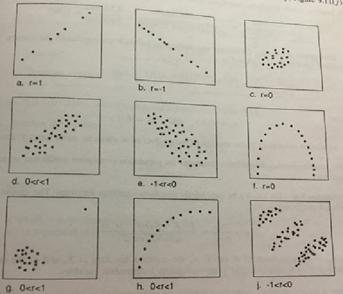
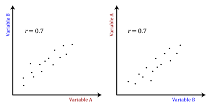
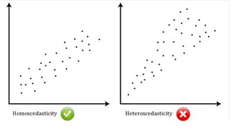

## OUTLINE OF THE LECTURE

-   Hypothesis tests - advantages and disadvantages

-   Relationship between two continuous variables

-   Correlation

    -   Questions

    -   Null Hypothesis

    -   Assumptions

    -   Inferences and framework applicability

-   Linear regression

    -   Questions

    -   Null Hypothesis

    -   Assumptions

    -   Diagnosis

    -   Inferences and framework applicability

-   Inferential differences between correlation and simple linear
    regression:

    -   conceptual and practical

-   Regression of a continuous outcome on a categorical variable

    -   One-way ANOVA -- a form of regression, contrasts

-   Lessons from a regression of a highly skewed dependent variable on a
    categorical variable

## HYPOTHESIS TESTING

## Advantages

-   Always a good start in research - great exploratory value

-   Computationally quick and easy

-   Tailored to the statistical nature of the variable of interest - the
    outcome/response/dependent variable Tailored to the inherited
    dependencies in the data

-   In well designed studies and successful data collection (a well
    designed and conducted clinical trial) - they can have confirmatory
    value

## Disadvantages

-   Often subjected to over - interpretation

-   Often discussed disregarding the **study design, data collection and
    sample size**

-   Limited to groups comparisons

-   Do not deal with explaining variability in the outcomes attributable
    to more than one independent variable

-   Advanced methods are needed to deal with explaining the variability
    of an outcome of interest

## CORRELATION BETWEEN TWO VARIABLES

-   Measures the "degree of a relationship" between two variables;

    -   height and weight

    -   systolic and diastolic blood pressure

-   Correlation ranges from -1 to +1.

    -   Negative: as one variable increases the other variable
        decreases.

    -   Positive: as one variable increases the other variable increases

        

-   Data needed: only two variables

    -   Interval/Ratio -- continuous

    -   Ordinal

-   Parametric version: Pearson correlation coefficient

    -   The variables must be *normally distributed*

    -   They relationship between them is assumed to be linear

-   Non Parametric version:

    -   Spearman's rank correlation coefficient

    -   Kendall's rank correlation tau

        -   *No distributional assumptions* on the variables needed

        -   Measures the degree of a monotonic relationship between the
            two variables

-   **There is no in/dependent variable: the relationship is mutual**

    

## PARAMETRIC PARADIGM: Pearson correlation assumptions

-   The two continuous variables should be **paired**, which means that
    each case (e.g., each participant) has two values: one for each
    variable.

-   There should be **independence of pairs**, which means that the two
    observations for one case (e.g., the scores for maths and reading
    performance for "student \#1") should be **independent** of the two
    observations for any other case.

-   If the pairs are **not independent**, they are **related**, and
    Pearson's correlation is not an appropriate statistical test
    (although there are other measures of association that can be used
    when you have observations that are not independent).

-   There should be a **linear relationship** between your two normally
    distributed continuous variables.

-   There should be **homoscedasticity**, which means that the variances
    along the line of best fit remain **similar** as you move along the
    line.

    

-   Hypothesis testing formulation

    -   **H0: there is no linear mutual relationship between the two
        variables**

    -   **H1: there is a linear mutual relationship between the two
        variables**

## NON PARAMETRIC PARADIGM: **Kendall's Tau vs. Spearman's rho**

-   **Kendall's Tau**:

    -   usually smaller values than Spearman's rho correlation.

    -   less sensitive to potential errors.

    -   P-values are more accurate with smaller sample sizes.

-   **Spearman's rho**:

    -   much more sensitive to error and discrepancies in data.

    -   Spearman's rank correlation coefficient remain the most widely
        used rank correlation coefficient.

-   Pair-wise correlations are advisable for a series of variables in
    the data

    ## WORKED EXAMPLE IN R

-   The data are based on a health survey conducted in the US in 2018 as
    part of National Health and Nutrition Examination survey. It can
    only be used for didactic purposes and not to be used for
    publication. The analysis should include survey weights which we
    ignore at the moment. Selected variables include: age, gender,
    ethnicity (white, black and others), weight, height, bmi,
    systolic/diastolic blood pressure, cholesterol levels, diabetes.

### Reading the data in R

```{r}
##reading the data in
mydata <-read.table("SurveyUS_data2018_selected.txt", header=T, sep="\t")
```

### Data dimension (number of rows and variables)

```{r}
##display your data size
dim(mydata)
```

### Variables' names

```{r }
##display the names of the variables
##Please see a more detailed documentation in the word document
names(mydata)
```

### Summary of the data at hand

```{r}
##Let's summarize the data to get a flavor of their nature
summary(mydata)
```

### Visual assessment

```{r}
##Let's summarize the systolic blood pressure by race
summary<-ddply(mydata, "race", summarise, 
               grp.mean=mean(bpsystol),
               grp.sd=sd(bpsystol),
               grp.median=median(bpsystol), 
               grp.quant25=quantile(bpsystol, c(.25)), 
               grp.quant75=quantile(bpsystol, c(.75)), 
               grp.min=min(bpsystol), 
               grp.max=max(bpsystol),
               grp.count= length(bpsystol))
summary
##this line produces the science score means across groups and stores them in the grp.mean
mu <- ddply(mydata, "race", summarise, grp.mean=mean(bpsystol))

##this line displays the 3 means
head(mu)


ggplot(mydata, aes(x=bpsystol, color=race) ) +
  geom_histogram(fill="white", position="dodge")+
  geom_vline(data=mu, aes(xintercept=grp.mean, color=race), linetype="dashed")+
  theme(legend.position="top")+
  guides(color=guide_legend("SBP:"))+
  labs(title = "SBP by ethnic group", y = "Frequency", x="SBP") 

```

```{r}
##Let's summarize the systolic blood pressure by sex
summary<-ddply(mydata, "sex", summarise, 
               grp.mean=mean(bpsystol),
               grp.sd=sd(bpsystol),
               grp.median=median(bpsystol), 
               grp.quant25=quantile(bpsystol, c(.25)), 
               grp.quant75=quantile(bpsystol, c(.75)), 
               grp.min=min(bpsystol), 
               grp.max=max(bpsystol),
               grp.count= length(bpsystol))
summary
##this line produces the science score means across groups and stores them in the grp.mean
mu <- ddply(mydata, "sex", summarise, grp.mean=mean(bpsystol))

##this line displays the 3 means
head(mu)


ggplot(mydata, aes(x=bpsystol, color=sex) ) +
  geom_histogram(fill="white", position="dodge")+
  geom_vline(data=mu, aes(xintercept=grp.mean, color=sex), linetype="dashed")+
  theme(legend.position="top")+
  guides(color=guide_legend("SBP:"))+
  labs(title = "SBP by gender", y = "Frequency", x="SBP") 

```

## CORRELATION between SBP and DBP

```{r}
pearson <- cor.test(mydata$bpsystol, mydata$bpdiast,  method = "pearson")
pearson

kendall <- cor.test(mydata$bpsystol, mydata$bpdiast,  method = "kendall")
kendall

spearman <- cor.test(mydata$bpsystol, mydata$bpdiast,  method = "spearman")
spearman

spearman <- cor.test(mydata$bpsystol, mydata$bpdiast,  method = "spearman", exact=FALSE)
spearman

plot(mydata$bpsystol, mydata$bpdiast, main="SBP vs. DBP",
   xlab="DBP", ylab="SBP", pch=1)

plot( mydata$bpdiast, mydata$bpsystol, main="DBP vs. SBP",
   xlab="SBP", ylab="DBP", pch=2)

```

## PAIRWISE CORRELATION

```{r}
myvars <- c("age", "height", "weight","bpsystol", "bpdiast", "tcresult", "bmi")
newdata <- mydata[myvars]

pairs(newdata)

pairs(newdata,                     # Data frame of variables
      labels = colnames(newdata),  # Variable names
      pch = 1,                     # Pch symbol
      cex=0.2,                     # Pch size
      col="black",                 # Pch color
      main = "Survey dataset",     # Title of the plot
      row1attop = TRUE,            # If FALSE, changes the direction of the diagonal
      gap = 1,                     # Distance between subplots
      cex.labels = NULL,           # Size of the diagonal text
      font.labels = 1)             # Font style of the diagonal text


groups <- mydata[, 3] # Factor variable (groups)
pairs(newdata,                     # Data frame of variables
      labels = colnames(newdata),  # Variable names
      pch = 21,                    # Pch symbol
      cex=0.2,                     # Pch size
      bg = rainbow(3)[groups],     # Background color of the symbol (pch 21 to 25)
      col = rainbow(3)[groups],    # Border color of the symbol
      main = "Survey dataset",     # Title of the plot
      row1attop = TRUE,            # If FALSE, changes the direction of the diagonal
      gap = 1,                     # Distance between subplots
      cex.labels = NULL,           # Size of the diagonal text
      font.labels = 1)             # Font style of the diagonal text
```

## 