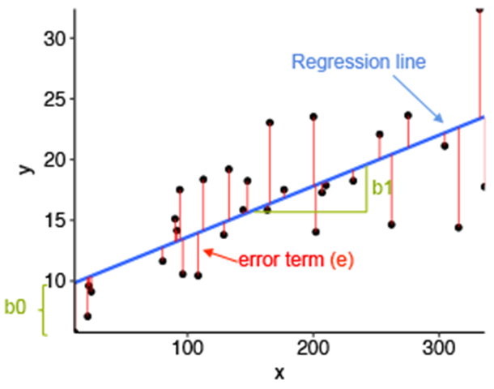

```{r setup, include=FALSE}
knitr::opts_chunk$set(echo = TRUE)
```

## **SIMPLE LINEAR REGRESSION ASSOCIATED CONCEPTS**

-   **NOT** a mutual **BUT** a linear relationship

    -   Y = **outcome/response/dependent** variable

    -   X = **independent** variable also potentially called
        **predictor/explanatory variable**

-   Usually, there is X precedes/implies Y

    -   blood pressure is dependent on age

    -   height depended on age (albeit necessarily linear)

-   **Regression line/prediction line/fitted line/the line of best fit**

-   **Regression coefficients:**

    -   b0= intercept - to be estimated from the data

    -   b1= **the slope - to be estimated from the data and measures the
        association between Y and X**

    -   **Ŷ=** b0+b1×**X**

        

-   **Residual/Error term (the noise)** = the difference between the
    observed Y value and the fitted (by the line) Y ̂value for the
    same X. In other words the difference between observed data and the
    corresponding predictions

-   The line of the best fit crosses through the two-way plot such that
    it minimizes the sum of the squares of the residuals. The process is
    called ordinary **least squares (OLS)**  - and this is purely
    geometric.

-   What makes the regression [***a probability model***]{.ul} is the
    [***residuals normality assumption***]{.ul}. 

## LINEAR REGRESSION on a continuous variables

-   The simple linear regression  - investigates a univariate linear
    [**association**]{.ul} between an outcome and an independent
    variable.

-   The potential linear relationship between two variables - [**is NOT
    a mutual relationship**]{.ul} as in correlation

-   **Hypothesis testing**

    -   H0: there is no linear relationship between the independent and
        the dependent variable (b1=0)

    -   H1: there is a linear relationship between the independent and
        the dependent variable (b1≠0)

-   Regression can be applied easily -- but [**assumptions need to
    hold**]{.ul} in order to make inferences/predictions

    -   Judgment based:

        -   The ***outcome/dependent/response variable***

            -   must be ***continuous*** and

            -   observations must be ***independent***

    -   Computer aid based:

        -   Linear association (visualized the data)

        -   **Residuals follow a normal distribution - not an assumption
            for the outcome!**

        -   Homogeneity of the residual variance (the antonym is
            homoskedasticity)

        -   In addition -- diagnostic plots identify influential points

            -   Outliers: reference to extreme values in the outcome
                (**dependent)** variable

            -   High-leverage points: reference to extreme values in the
                explanatory (**independent**) variable

## PREDICTION

-   The fitted straight line which indicates a systematic signal in the
    data is also referred to as to prediction line

-   The slope coefficient is interpreted as the average change in the
    outcome/response/dependent variable for one unit increase in the
    independent/explanatory variable (also referred to as the predictor)

-   It this so simple? When is this appropriate?

-   The validity of the predictions depends on

    -   Study design

    -   Population representation of the sample

    -   Stage of the research

-   In observational studies, disease/social outcomes are explained by
    multiple explanatory variables - multivariable regression techniques

-   Very useful for resource allocation but need to be valid and based
    on multiple replications of studies

-   A [***prediction interval***]{.ul} reflects the uncertainty around a
    single value

-   A [***confidence interval***]{.ul} reflects the uncertainty around
    the mean prediction values. Thus, a prediction interval will be
    generally much wider than a confidence interval for the same value.

-   Which one should we use? The answer to this question depends on the
    context and the purpose of the analysis. Generally, we are
    interested in specific individual predictions, so a prediction
    interval would be more appropriate. Using a confidence interval when
    you should be using a prediction interval will greatly underestimate
    the uncertainty in a given predicted value.

## LINEAR REGRESSION on a continuous variable

-   Epidemiological question: Is there any association between SBP and
    age?

-   Hypothesis testing

    -   H0: There is no linear relationship between SBP and age (b1=0)

    -   H1: There is a linear relationship between SBP and age (b1is not

        0)  

    -   The hypothesis test framework does not involve the intercept
        (b0)

```{r}
##reading the data in
mydata <-read.table("SurveyUS_data2018_selected.txt", header=T, sep="\t")
##fit the regression
reg_SBPonAGE<-lm(formula = mydata$bpsystol~mydata$age, data = mydata)
summary(reg_SBPonAGE)
confint(reg_SBPonAGE)

pearson <- cor.test(mydata$bpsystol, mydata$age,  method = "pearson")
pearson
```

### LINEAR REGRESSION on a continuous variable - Potential Interpretation

-   There is strong evidence against the null hypothesis of no linear
    relationship between SBP and age (p\<0.001). For one year increase
    in age there is a 0.65(95%CI(0.63-0.67)) increase in the SBP.

-   Is the correlation between the two a valid question?

-   Even if it was; the correlation coefficient is different from of
    regression.

-   The magnitude of the slope can be any number; the correlation
    coefficient is always between -1 and 1.

-   Is the inference valid?

### LINEAR REGRESSION on a continuous variable - Model diagnosis

```{r}
##checking assumptions -all 4

par(mfrow=c(2,2))
plot(reg_SBPonAGE)
par(mfrow=c(1,1))

##Cook's distance points

cutoff <-4/(nrow(mydata))
cutoff
plot(reg_SBPonAGE, which=4, cook.levels=cutoff)
```

-   **Residuals vs Fitted**: Used to check the linear relationship
    assumptions. A horizontal line, without distinct patterns is an
    indication for a linear relationship, which is expected if the
    assumption is true.

-   **Normal Q-Q** plot: Used to examine whether the residuals are
    normally distributed. It's good if residuals points follow the
    straight dashed line.

-   **Scale-Location** (or Spread-Location). Used to check the
    homogeneity of variance of the residuals (homoscedasticity).
    Horizontal line with equally spread points is a good indication of
    homoscedasticity.

-   **Residuals vs Leverage**. A high leverage point in regression
    context is a value in the independent variable far away from the
    rest. Used to identify influential cases, that is extreme values
    that might influence the regression results when included or
    excluded from the analysis.

-   **Cook's distance plot**

    -   A different way to identify points that will have an impact on
        the estimated slope of the regression model.

    -   The measurement is a combination of each observation's leverage
        and residual values; the higher the leverage and residuals, the
        higher the Cook's distance.

    -   R indicates the potential influential points for which Cook's
        distance \>4/n

**The regression R object produces all the diagnosis plots after
regression fit !**

-   The red lines on the plots should not indicate any trend. Potential
    shape of these lines may suggest a nonlinear relationship between
    the two variables.

-   Outliers should be investigated, i.e. dropping the observations from
    the data and re-run the model - sensitivity of the estimates to the
    assumptions

-   In this particular example the results should be interpreted with
    great caution. The QQ normal plot indicate a potential quadratic
    relationship between the two variables.

```{r}
##DROPPING THE problematic observations
mydata_sensitivity <- mydata[-c(4457, 6658, 6725, 7907), ]

dim(mydata)
dim(mydata_sensitivity)

reg_SBPonAGE_sensitivity<-lm(formula = mydata$bpsystol~mydata$age , data = mydata_sensitivity)
summary(reg_SBPonAGE_sensitivity)
confint(reg_SBPonAGE_sensitivity)


par(mfrow=c(2,2))
plot(reg_SBPonAGE_sensitivity)
par(mfrow=c(1,1))

cutoff <-4/(nrow(mydata_sensitivity))
cutoff
plot(reg_SBPonAGE_sensitivity, which=4, cook.levels=cutoff)

```

### LINEAR REGRESSION on a continuous variable - PREDICTIONS

```{r}
reg_SBPonAGE<-lm(formula = mydata$bpsystol~mydata$age, data = mydata)
summary(reg_SBPonAGE)
confint(reg_SBPonAGE)

##produce predictions for the mean
pred_reg_SBPonAGE = predict(reg_SBPonAGE, interval = "confidence") 

##bind the data and the predictions
dat_pred_reg_SBPonAGE= cbind(mydata, pred_reg_SBPonAGE)  

ggplot(dat_pred_reg_SBPonAGE, aes(x =age , y =bpsystol) ) +
     geom_point() +
     geom_ribbon( aes(ymin = lwr, ymax = upr ), alpha = .15) +
     geom_line( aes(y = fit), size = 1) +
     geom_smooth(method=lm, se=TRUE)

##produce predictions for future values of age
pred_reg_SBPonAGE_alt=data.frame(mydata, predict(reg_SBPonAGE, interval="prediction"))

ggplot(pred_reg_SBPonAGE_alt, aes(x =age , y =bpsystol)) + 
    geom_ribbon(aes(ymin = lwr, ymax = upr, fill='prediction'), 
        fill = "black", alpha = 0.2) +
    geom_smooth(method = "lm", se = FALSE, col = "black") +
    geom_point(size = 1, col = "firebrick") + 
    labs(x = "Age", y = "SBP") + 
    theme_classic()


```

Assuming all assumptions are reasonably met

-   Predicted line: predicted values of Y (SBP) and their 95%CIs for
    fixed values of X (age) within data range. In other words, for any
    fixed value of age within the data range the expected value of SBP
    would lie on the regression line.

-   The 95% prediction intervals show the uncertainty for the predicted
    value of a new value of age. This prediction interval is wider than
    the confidence bands for the line of the best fit - it accounts for
    the variability of the new values for age.

## An example on a smaller data set for the difference between the prediction interval and confidence interval for the mean

Data source: Medley and Clements (1998) studied the response of diatom
communities to presence of heavy metals, especially zinc. They sampled a
number of stations (between 4 and 7) on six streams known to be polluted
by heavy metals in the Rocky Mountain region of Colorado, USA. They
recorded zinc concentration, species richness and species diversity of
the diatom community and proportion of diatom cells that were
early-successional species, Achanthes minutissima.

```{r, echo=FALSE}
mydata_species <-read.table("ANOVA_example.txt", header=T, sep="\t")
mydata_species
dim(mydata_species)
names(mydata_species)


##CAREFUL AT THE ORDER OF THE VARIABLES: IN LM IS Y~X WHILST IN PLOT IS (X, Y)

##run the regresssion model
##the dependent variable: mydata_species$DiversityH
##the independent variable: mydata_species$SpeciesRichness
reg<-lm(formula = mydata_species$DiversityH~mydata_species$SpeciesRichness, data = mydata_species)
summary(reg)
confint(reg)


##center the variable!
##checking assumptions -all 4

par(mfrow=c(2,2))
plot(reg)
par(mfrow=c(1,1))

##Cook's distance points

cutoff <-4/(nrow(mydata_species))
cutoff
plot(reg, which=4, cook.levels=cutoff)

##a quick plot visualising the regression line

##constructiong the prediction for the mean

##predictions for the mean
predslm = predict(reg, interval = "confidence") ##produce predictions
predslm
datlm = cbind(mydata_species, predslm)  ##bind the data and the predictions
datlm


ggplot(datlm, aes(x =SpeciesRichness , y =DiversityH) ) +
     geom_point() +
     geom_ribbon( aes(ymin = lwr, ymax = upr ), alpha = .15) +
     geom_line( aes(y = fit), size = 1)


##these differ by specification of a different option for the interval

mydata_species2 = data.frame(mydata_species, predict(reg, interval = "prediction"))

ggplot(mydata_species2, aes(SpeciesRichness, DiversityH)) + 
    geom_ribbon(aes(ymin = lwr, ymax = upr, fill='prediction'), 
        fill = "black", alpha = 0.2) +
    geom_smooth(method = "lm", se = FALSE, col = "black") +
    geom_point(size = 3, col = "firebrick") + 
    labs(x = "SpeciesRichness", y = "DiversityH") + 
    theme_classic()
##################################
#################################

```

## LINEAR REGRESSION on a categorical variable

-   If assumptions are met:

    -   This is ANOVA if the independent categorical (factor) variable
        has more then 2 levels

    -   t-test if the independent categorical (factor) variable has more
        then 2 levels

```{r}
reg_SBPonRACE<-lm(formula = mydata$bpsystol~mydata$race , data = mydata)
summary(reg_SBPonRACE)
confint(reg_SBPonRACE)

##model diagnosis
par(mfrow=c(2,2))
plot(reg_SBPonRACE)
par(mfrow=c(1,1))

cutoff <-4/(nrow(mydata))
cutoff
plot(reg_SBPonRACE, which=4, cook.levels=cutoff)
```

### LINEAR REGRESSION on a categorical variable - Potential Interpretation

-   Coefficients corresponding to groups' "slopes" are differences
    between the means of the outcomes of the respective group and the
    baseline (Black).

-   The evidence suggests that the SBP in Other ethnicity group is lower
    than in that in Blacks (p=0.005). The differences between the means
    is 5.0295%CI((-8.8- -1.5))

-   The evidence suggests that the SBP in White ethnicity group is lower
    than in that in Blacks (p\<0.001). The differences between the means
    is 3.19%CI((-4.66- -1.72))

-   The intercept - the mean SBP in the baseline group.

### LINEAR REGRESSION on a categorical variable - VISUALISE

```{r}
reg_SBPonRACE<-lm(formula = mydata$bpsystol~mydata$race , data = mydata)
summary(reg_SBPonRACE)
confint(reg_SBPonRACE)

##visualize the data at hand!
 
ggplot(mydata, aes(x=race, y=bpsystol, fill=race)) + 
    geom_boxplot()

##visualize inferential results

sum = summarySE(mydata,
                measurevar="bpsystol",
                groupvars=c("race"))
sum

pd = position_dodge(.2)
ggplot(sum, aes(x=race,
                y=bpsystol)) +
    geom_errorbar(aes(ymin=bpsystol-1.96*se,
                      ymax=bpsystol+1.96*se),
                   width=.2, size=0.7, position=pd) +
    geom_point(shape=15, size=4, position=pd) +
    theme_bw() +
    theme(
          axis.title.y = element_text(vjust= 1.8),
          axis.title.x = element_text(vjust= -0.5),
          axis.title = element_text(face = "bold")) +
    scale_color_manual(values = c("black", "blue", "green"))
```

## MULTIVARIABLE REGRESSION

-   What about trying to explain the variability in SBP by age and
    race/sex?

-   That is the beauty of regression - neither ANOVA nor statistical
    tests can accommodate for this

-   Disease is usually multi-factorial and many factors can contribute
    to explain it

### MULTIVARIABLE REGRESSION - one factor and one continuous variable

-   The null hypothesis

    -   H0: There is no association between SBP and age [***AND***]{.ul}
        no association between SBP and race

    -   H1: There is an association between SBP and age [***OR***]{.ul}
        an association between SBP and race

```{r}

##MODEL WITH NO INTERACTION
reg_SBPonRACEandAGE_NO_INT<-lm(formula = mydata$bpsystol~mydata$race+mydata$age , data = mydata)
summary(reg_SBPonRACEandAGE_NO_INT)
confint(reg_SBPonRACEandAGE_NO_INT)


par(mfrow=c(2,2))
plot(reg_SBPonRACEandAGE_NO_INT)
par(mfrow=c(1,1))

cutoff <-4/(nrow(mydata))
cutoff
plot(reg_SBPonRACEandAGE_NO_INT, which=4, cook.levels=cutoff)


mydata$pred_SBPonRACEandAGE_NO_INT = predict(reg_SBPonRACEandAGE_NO_INT)

ggplot(mydata, aes(x = age, y = bpsystol, color = race) ) +
     geom_point(shape = 21, size = 0.5, fill = "white") +
     geom_line(aes(y = pred_SBPonRACEandAGE_NO_INT))

##center the age to interpret the intercept
mydata$age_center<-mydata$age-47.5818

reg_SBPonRACEandAGE_NO_INT<-lm(formula = mydata$bpsystol~mydata$race+mydata$age_center , data = mydata)
summary(reg_SBPonRACEandAGE_NO_INT)
confint(reg_SBPonRACEandAGE_NO_INT)

```

### MULTIVARIABLE REGRESSION - one factor and one continuous variable - interpretation

-   There is strong evidence against the null hypothesis of no linear
    relationship between SBP and age (p\<0.001). For one year increase
    in age there is a 0.65(95%CI(0.63-0.68)) increase in the SBP. This
    is the effect of age adjusted/controlled for race.

<!-- -->

-   When adjusted for age, the evidence suggests that the SBP in Other
    ethnicity group is lower than in that in Blacks (p=0.016). The
    adjusted difference between the means is 3.8(95%CI((-6.9- -0.72))
    (unadjusted was 5.02(95%CI((-8.8- -1.5)))

-   When adjusted for age, the evidence suggests that the SBP in White
    ethnicity group is lower than in that in Blacks (p\<0.001). The
    adjusted difference between the means is 4.43(95%CI((-5.7- -3.14))
    (unadjusted was 3.19%CI((-4.66- -1.72))

-   134.84 - the mean SBP in the baseline group (Black) - for the
    average age of 47.6 years in the data.

### MULTIVARIABLE REGRESSION - one factor and one continuous variable interaction

Question: Is the increase in SBP with age similar across all ethnic
groups?

```{r}

##MODEL WITH INTERACTION
reg_SBPonRACEandAGE_WITH_INT<-lm(formula = mydata$bpsystol~mydata$race*mydata$age_center , data = mydata)
summary(reg_SBPonRACEandAGE_WITH_INT)
confint(reg_SBPonRACEandAGE_WITH_INT)


par(mfrow=c(2,2))
plot(reg_SBPonRACEandAGE_WITH_INT)
par(mfrow=c(1,1))

cutoff <-4/(nrow(mydata))
cutoff
plot(reg_SBPonRACEandAGE_WITH_INT, which=4, cook.levels=cutoff)


mydata$pred_SBPonRACEandAGE_WITH_INT = predict(reg_SBPonRACEandAGE_WITH_INT)

ggplot(mydata, aes(x = age, y = bpsystol, color = race) ) +
     geom_point(shape = 21, size = 0.5, fill = "white") +
     geom_line(aes(y = pred_SBPonRACEandAGE_WITH_INT))


```

-   0.77(95%CI(0.70-0.84)) increase in SBP with one year of age in Black
    ethnic group.

-   There is strong evidence of an interaction between age and race on
    SBP

-   That means that the increase in SBP with age is not similar across
    ethnic groups

-   0.18(0.004-0.36) is the additional increase in SBP with age in
    Others group, i.e. the slope in this group is 0.77+0.18= 0.95

-   -0.13(-0.21--0.06) indicates that the increase in SBP with age in
    White group is smaller, i.e. the slope in this group is
    0.77-0.13=0.64

-   the mean SBP in the baseline group (Black) - for the average age of
    47.6 years in the data.

### MULTIVARIABLE REGRESSION - two factors interaction

-   Revise ANOVA lecture !

-   No interaction

-   The coefficients represent the differences in SBP means between the
    levels of each category factors vs. its baseline adjusted for the
    other factor.

-   In the absence of the interaction the differences in SBP means
    between race levels do not depend on gender and the other way
    around: the difference in SBP means between gender remain the same
    across race groups.

```{r}
reg_SBPonRACEandGENGER<-lm(formula = mydata$bpsystol~mydata$race+mydata$sex , data = mydata)
summary(reg_SBPonRACEandGENGER)
confint(reg_SBPonRACEandGENGER)


par(mfrow=c(2,2))
plot(reg_SBPonRACEandGENGER)
par(mfrow=c(1,1))

cutoff <-4/(nrow(mydata))
cutoff
plot(reg_SBPonRACEandGENGER, which=4, cook.levels=cutoff)


##DESCRIPTIVE PLOTS
ggplot(mydata, aes(x=race, y=bpsystol, fill=sex)) + 
    geom_boxplot()

ggplot(mydata, aes(x=sex, y=bpsystol, fill=race)) + 
    geom_boxplot()


##INFERENTIAL PLOTS

sum = summarySE(mydata,
                measurevar="bpsystol",
                groupvars=c("sex","race"))
sum

pd = position_dodge(.2)
ggplot(sum, aes(x=race,
                y=bpsystol,
                color=sex)) +
    geom_errorbar(aes(ymin=bpsystol-1.96*se,
                      ymax=bpsystol+1.96*se),
                   width=.2, size=0.7, position=pd) +
    geom_point(shape=15, size=4, position=pd) +
    theme_bw() +
    theme(
          axis.title.y = element_text(vjust= 1.8),
          axis.title.x = element_text(vjust= -0.5),
          axis.title = element_text(face = "bold")) +
    scale_color_manual(values = c("black", "blue"))
```

-   Interaction

-   If significant - the interaction is kept in the model

-   In the absence of the interaction the differences in SBP means
    between race levels are different in men and women and the other way
    around: the difference in means SBP means men and women differ
    across race groups.

```{r}
reg_SBPonRACEandGENGER_INT<-lm(formula = mydata$bpsystol~mydata$race*mydata$sex , data = mydata)
summary(reg_SBPonRACEandGENGER_INT)
confint(reg_SBPonRACEandGENGER_INT)


par(mfrow=c(2,2))
plot(reg_SBPonRACEandGENGER_INT)
par(mfrow=c(1,1))

cutoff <-4/(nrow(mydata))
cutoff
plot(reg_SBPonRACEandGENGER_INT, which=4, cook.levels=cutoff)

##INFERENTIAL PLOTS

```

## WRAP UP

-   Multivariable regression - an advance methods which accommodates for
    multiple predictors and potential interactions between them

-   To understand the effect of one variable - all others are said to be
    held constant

-   Adjusted analysis of the outcome - controlling for multiple
    explanatory variables

-   Applicable to continuous outcomes: blood presure, bmi, height

-   Methods for model choice aim at parsimony: a model with the least
    number of predictors, yet explaining the most variability in the
    outcome

-   Post data collection techniques to adjust for confounding

-   Missing data - beyond the scope of this presentation

## HOMEWORK

Please use similar techniques for DPB as a continuous outcome. You can
fit a multiple regression on age, gender, race and BMI.
